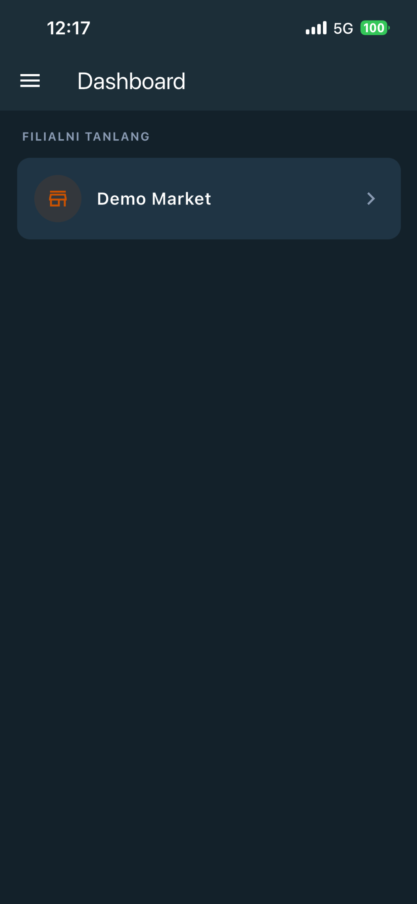
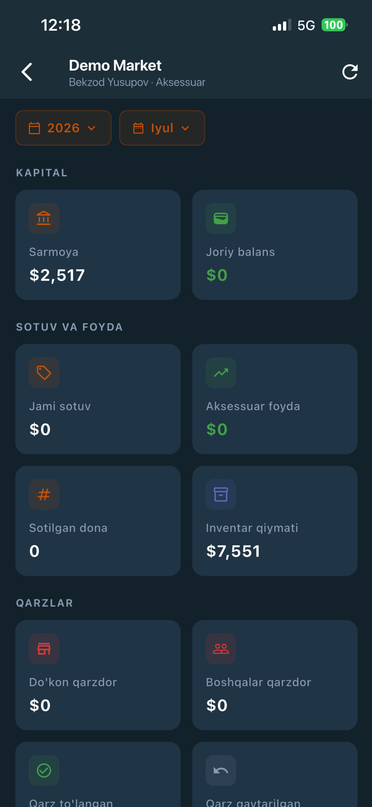
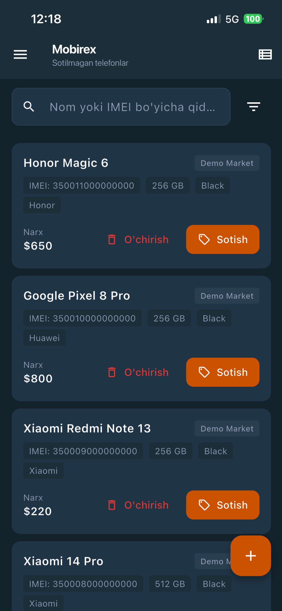

# Mobirex

**CRM/ERP for phone and accessory retail shops in Uzbekistan.**
Django + DRF backend, Flutter mobile app, live in production.


🌐 [mobirex.uz](https://mobirex.uz) · 🔌 `api.mobirex.uz` · 📱 [Google Play](https://play.google.com/store/apps/details?id=uz.mobirex.app)

> **This repository is a selected part of the codebase, not the whole project.**
> The President Tech Award application asks for *a part* of the project's code.
> See [What is in this repository](#what-is-in-this-repository) for what was
> included and why.

---

## The problem

Phone shops in Uzbekistan run on paper notebooks, Excel files and Telegram
messages. Stock, sales, staff salaries and customer debt all live in different
places, and none of them reconcile. The owner of a two-branch shop cannot
answer basic questions: who sold what today, how much cash is in each branch,
who still owes money, what the actual profit was last month.

The specific problem is not "no software" — it is that the shop's money moves
through several independent channels at once. Phones and accessories are bought
from different suppliers with different capital, sold by different staff, and
customers take goods on credit in both directions ("we gave" / "we took").
Generic retail software collapses this into one inventory number and the numbers
stop matching reality within a week.

## The solution

Mobirex models the shop the way the shop actually works:

- **Two independent capital pools** per branch — phone capital and accessory
  capital never mix. Every operation debits or credits exactly one of them.
- **Role-scoped access** — an owner sees all their branches; a phone seller sees
  only phones in their branch; an accessory seller sees only accessories.
- **Bidirectional debt** — a debt has a direction and a domain, so "the customer
  owes us for a phone" and "we owe the supplier for accessories" are tracked
  separately and hit the correct capital pool.
- **Month closing** — at month end unsold stock rolls into the next month as new
  purchases and the closing month's dashboard is frozen into a snapshot, so a
  later edit cannot rewrite a report the owner already read.
- **Subscription billing** — a daily fee is charged per account, with a 3-day
  grace period before the account is blocked.

## Screenshots

| Login | Dashboard |
|---|---|
|  |  |

| Reports | Phone stock |
|---|---|
|  |  |

---

## Architecture

```
                Flutter app (Riverpod · GoRouter · Dio)
                              │
                     HTTPS · JWT bearer
                              │
        ┌─────────────────────▼─────────────────────┐
        │  nginx  (TLS termination, static, media)  │
        └─────────────────────┬─────────────────────┘
                              │
        ┌─────────────────────▼─────────────────────┐
        │  API layer      views · serializers       │  ← HTTP only:
        │                 permissions · throttles   │    parse, authorise,
        └─────────────────────┬─────────────────────┘    shape the response
                              │
        ┌─────────────────────▼─────────────────────┐
        │  Service layer  every state mutation      │  ← all business rules,
        │                 transactions · locking    │    all money arithmetic
        └─────────────────────┬─────────────────────┘
                              │
        ┌─────────────────────▼─────────────────────┐
        │  Models         PostgreSQL · soft delete  │
        └───────────────────────────────────────────┘
                              │
              Celery + Redis — nightly billing,
              monthly closing, error notifications
```

**Why a service layer.** Views never write to the database. Every mutation goes
through a service that owns the transaction boundary, the capital arithmetic and
the audit-journal entry. The same service is called from the REST API, the Django
admin, a management command and a Celery task — which is exactly why the
transaction has to live in the service and not in the view.

**Multi-tenancy.** Isolation is three-dimensional: branch → role → domain. A user
holds roles per branch (`OWNER`, `PHONE_SELLER`, `ACCESSORY_SELLER`, cashier), and
the queryset for every endpoint is narrowed by all three. A phone seller and an
accessory seller can work in the same branch and see disjoint data.

---

## Technical highlights

### 1. Idempotent month-close

At month end, unsold stock is carried into the next month as a new purchase and
the closing month's dashboard is frozen into a snapshot. The operation runs from
both a management command and a Celery beat task, so it **must** be safe to run
twice — a duplicate run would otherwise roll the same inventory over again and
double-charge the capital pool.

A `MonthClosingRecord` with a `UniqueConstraint(branch, month)` is the idempotency
key. The record is claimed in its own transaction *before* the work starts; a
concurrent second run hits the `IntegrityError`, re-reads the record and returns
`skipped`. Inside the main transaction the branch row is locked with
`select_for_update()`, and rollover reads take row locks too. A crash marks the
record `failed`, and a record left `started` for more than 6 hours is treated as
stale and retried — otherwise one crashed run would block that branch forever.
`dry_run` executes the whole path and then calls `transaction.set_rollback(True)`,
so the preview is computed by the exact same code as the real run.

→ [`backend/services/month_closing/service.py`](backend/services/month_closing/service.py)
· tested under real thread contention in
[`backend/tests/test_month_closing_race.py`](backend/tests/test_month_closing_race.py)

### 2. Separate capital pools, mutated under lock

Phones and accessories are financially independent verticals. Which pool an
operation touches is derived from the actor's role, not from a client-supplied
field — a phone seller cannot address accessory capital even by crafting the
request:

```python
# backend/services/capital/capital_service.py
@staticmethod
def get_capital_for_user(user, branch, month_start, capital_type=None):
    if user.has_role("PHONE_SELLER", branch):
        if capital_type and capital_type != "phone":
            raise ValidationError(_("Ruxsat yo'q."))
        return CapitalService.get_phone_capital(branch, month_start)
    ...
    # Owners must state the type explicitly — they can reach both pools.
    if not capital_type:
        raise ValidationError(_("Egasi kapital turini ko'rsatishi shart."))
```

Every capital row is fetched with `select_for_update()` and every mutation runs
inside `transaction.atomic()`, so two concurrent sales in the same branch cannot
lose an update.

→ [`backend/services/capital/capital_service.py`](backend/services/capital/capital_service.py)
· [`backend/tests/test_capital_isolation.py`](backend/tests/test_capital_isolation.py)

### 3. Frozen historical reports

A dashboard for a past month is served from `DashboardSnapshot`, not recomputed.
Once a month is closed, editing an old record cannot silently rewrite a report the
owner already acted on. The current month is always computed live.

### 4. Subscription billing with a grace period

A nightly Celery task charges each account its daily fee. The charge is idempotent
per `(user, charge_day)` — a re-run finds the existing `TransactionLog` and skips
rather than double-charging. A negative balance starts a 3-day grace window; after
that the account is blocked.

Enforcement is a single permission appended to *every* `BaseAPIView` endpoint, so
a new endpoint cannot forget it. The check is read-only (`persist=False`): it
reflects the state the nightly job maintains, it never mutates the account on a
request path.

```python
# backend/api/base.py
def get_permissions(self):
    """Append billing-block enforcement to each view's own permissions."""
    return [*super().get_permissions(), IsAccountActive()]
```

A blocked account returns HTTP **402** with a structured body
(`error.code == "account_blocked"`) rather than a bare 403, so the mobile client
can route to the blocked screen instead of logging the user out.

→ [`backend/services/billing/`](backend/services/billing)
· [`backend/api/permissions.py`](backend/api/permissions.py)

### 5. Deduplicated error reporting to Telegram

Backend exceptions and mobile crashes land in one `ErrorReport` table, keyed by a
SHA-256 fingerprint of `(source, error_type, path, status_code, kind)`. A repeat
increments `occurrence_count` under `select_for_update()` instead of inserting a
new row. Telegram is notified on the first occurrence, at the 10/100/1000
milestones and always for `CRITICAL` — with a 5-minute floor between messages, so
a failing endpoint under load cannot flood the channel.

Two failure modes the implementation has to survive: the notifier is a **silent
no-op** when the token is unconfigured (reports still persist), and the logging
handler drops any record originating from its own package — otherwise reporting an
error would log an error would report an error.

→ [`backend/services/error_reporting/`](backend/services/error_reporting)

### 6. Token refresh without losing the request

The Flutter client uses a `QueuedInterceptorsWrapper`, so parallel requests hitting
an expired token queue behind a single refresh instead of firing N refresh calls.
The refresh itself goes through a separate `Dio` instance to avoid interceptor
recursion, and the original request is replayed with the new token. The 402
billing block is handled in its own branch and never touches the 401 path — the
user is blocked, not logged out.

→ [`mobile/core/network/interceptors/auth_interceptor.dart`](mobile/core/network/interceptors/auth_interceptor.dart)

---

## What is in this repository

A selection — 39 files out of a much larger codebase — chosen to show
architecture and judgement rather than volume. Migrations, settings, `__init__.py`
files, generated code and dependency locks are deliberately excluded, as is
anything that could carry a credential.

| Path | What it shows |
|---|---|
| `backend/services/month_closing/` | the hardest logic in the project: idempotency, locking, rollover, snapshots |
| `backend/services/capital/` | the two-pool capital model and role-derived access |
| `backend/services/billing/` | daily charge, grace period, access decisions |
| `backend/services/phone/`, `backend/services/debt/` | per-operation capital arithmetic and the audit journal |
| `backend/services/error_reporting/` | fingerprinting, deduplication, rate-limited notification |
| `backend/api/` | response envelope, exception handling, permissions, throttles, one full view module |
| `backend/models/` | three representative models (constraints, indexes, soft delete) |
| `backend/tests/` | the month-close suite, including a real thread-contention test |
| `mobile/core/` | networking, JWT refresh, theme tokens, error reporting |
| `mobile/features/phones/` | one complete vertical slice: model → repository → provider → page |
| `infra/` | Docker Compose and nginx, **sanitised** — every credential is a placeholder |

**Not included:** environment files, Android signing keys, database dumps, deploy
scripts, server configuration containing infrastructure detail, and the demo-data
generator (it contains a demo password). No real secret appears anywhere in this
repository.

## Tech stack

| Layer | Technology |
|---|---|
| Backend | Django 5.2, Django REST Framework, SimpleJWT, drf-spectacular |
| Database | PostgreSQL 15 |
| Async | Celery + Redis (nightly billing, monthly closing, notifications) |
| Mobile | Flutter, Riverpod, GoRouter, Dio, flutter_secure_storage |
| Bot | aiogram 3.x (support requests) |
| Landing | static HTML, three languages (UZ / RU / EN) |
| Infra | Docker Compose, nginx reverse proxy, Let's Encrypt |
| Testing | pytest + pytest-django, `TransactionTestCase` for concurrency |

## Status

- Backend running in production at `api.mobirex.uz`
- Android app **published on Google Play**
- iOS app **in App Store review**
- Landing site live at [mobirex.uz](https://mobirex.uz)
- No paying customers yet — the product is live and in early use

## Author

**Zohidillo Turgunov** — sole developer. Backend, mobile app, Telegram bot,
landing site and deployment.

## License

MIT — see [LICENSE](LICENSE).

---

## Qisqacha (o'zbekcha)

**Mobirex** — O'zbekistondagi telefon va aksessuar do'konlari uchun CRM/ERP
tizimi. Do'konlar hisobni daftar, Excel va Telegramda yuritadi; natijada egasi
oddiy savollarga javob bera olmaydi: bugun kim nima sotdi, qaysi filialda qancha
pul bor, kim qarzdor, o'tgan oyda foyda qancha bo'ldi.

Tizim do'konning haqiqiy ish tartibini modellashtiradi: telefon va aksessuar
kapitali bir-biriga aralashmaydi, har bir xodim faqat o'z filiali va o'z
yo'nalishini ko'radi, qarz ikki tomonlama ("berdik" / "oldik") yuritiladi, oy
oxirida sotilmagan tovar keyingi oyga o'tkaziladi va yopilgan oy hisoboti
snapshot sifatida muzlatiladi.

Backend Django 5.2 + DRF + PostgreSQL, mobil ilova Flutter (Riverpod), fon
vazifalari Celery + Redis, deploy Docker Compose + nginx orqali. Backend
`api.mobirex.uz` da ishlab turibdi, Android ilova Google Play'da chop etilgan,
iOS versiyasi App Store ko'rigida.

**Bu repozitoriyda loyihaning butun kodi emas, tanlangan qismi** (39 fayl)
joylashtirilgan — ariza shakli aynan kodning bir qismini so'ragani uchun.
Tanlashda hajm emas, muhandislik yechimi ko'rinadigan fayllar olindi: oy yopish
xizmati (idempotentlik, `select_for_update`, rollover), kapital izolyatsiyasi,
obuna to'lovi, xatoliklarni Telegram'ga yuborish, mobil tomondagi JWT refresh
navbati va testlar. Hech qanday maxfiy ma'lumot — token, parol, kalit, server
IP'si — bu yerda yo'q; konfiguratsiya fayllarida faqat placeholder qiymatlar
turibdi.

Loyihani bir kishi — **Zohidillo Turgunov** — yakka o'zi ishlab chiqqan.
