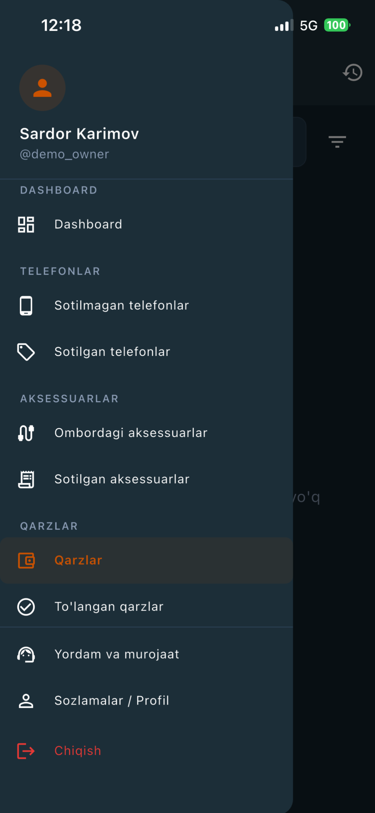
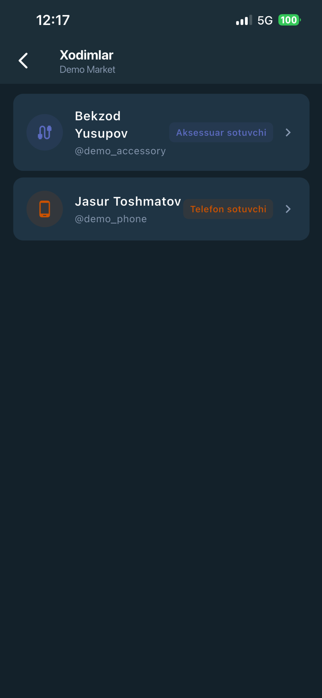

# Mobirex

**Telefon va aksessuar do'konlari uchun CRM/ERP tizimi**


---

## Bu repozitoriy nima

Bu — **Mobirex loyihasining butun kodi emas, tanlangan bir qismi**. Asosiy kod
bazasi yopiq repozitoriyda turadi; bu yerga arxitektura va muhandislik yechimini
ko'rsatadigan fayllar ajratib olingan.

Repozitoriy **Prezident Tech Award** arizasi uchun tayyorlandi — ariza shakli
loyiha kodining bir qismini so'raydi.

Tanlashda hajm emas, **qaror ko'rinadigan kod** mezoni ishlatildi: pul
arifmetikasi, parallel so'rovlarda to'g'ri ishlash, qatlamlar ajratilishi va
testlar. Migratsiyalar, sozlamalar, `__init__.py` va generatsiya qilingan
fayllar ataylab kiritilmadi.

> Jami **35 ta fayl**: 26 ta Python (backend), 9 ta Dart (mobil ilova).

---

## Muammo

O'zbekistondagi telefon do'konlari hisobni qog'oz daftar, Excel jadvali va
Telegram xabarlarida yuritadi. Tovar, sotuv, xodim maoshi va mijoz qarzi — har
biri alohida joyda, va ular bir-biriga to'g'ri kelmaydi. Ikki filialli do'kon
egasi eng oddiy savollarga javob bera olmaydi: bugun kim nima sotdi, qaysi
filialda qancha naqd pul bor, kim qarzdor, o'tgan oyning haqiqiy foydasi qancha
bo'ldi.

Asosiy qiyinchilik "dastur yo'q" emas. Do'konning puli bir vaqtning o'zida bir
nechta mustaqil kanal orqali harakatlanadi: telefon va aksessuar boshqa
ta'minotchidan, boshqa kapital hisobidan olinadi, boshqa xodim tomonidan
sotiladi, qarz esa ikki tomonga ham yuriydi. Umumiy do'kon dasturlari buni
bitta "ombor qoldig'i" raqamiga siqib qo'yadi — va bir hafta ichida raqamlar
haqiqatga to'g'ri kelmay qoladi.

## Yechim

Mobirex do'konni aynan ishlaydigan tartibida modellashtiradi:

- **Ikki mustaqil kapital hovuzi** — har filialda telefon kapitali va aksessuar
  kapitali aralashmaydi. Har bir amaliyot aniq bittasidan yechadi yoki
  bittasiga qo'shadi.
- **Rol bo'yicha kirish** — egasi o'z filiallarining hammasini ko'radi; telefon
  sotuvchi faqat o'z filialidagi telefonlarni; aksessuar sotuvchi faqat
  aksessuarlarni.
- **Ikki tomonlama qarz** — qarzning yo'nalishi ("berdik" / "oldik") va
  yo'nalishi bo'yicha domeni bor, shuning uchun "mijoz telefon uchun qarzdor"
  bilan "biz ta'minotchiga aksessuar uchun qarzdormiz" alohida yuritiladi va
  kerakli kapital hovuziga tegadi.
- **Oy yopilishi** — oy oxirida sotilmagan tovar keyingi oyga yangi xarid
  sifatida o'tkaziladi, yopilgan oy hisoboti esa snapshot qilib muzlatiladi.
  Keyinchalik eski yozuv tahrirlansa ham, egasi allaqachon o'qigan hisobot
  o'zgarmaydi.
- **Obuna to'lovi** — har kuni hisobdan kunlik to'lov yechiladi, balans
  minusga tushsa 3 kunlik imtiyoz muddati beriladi, undan keyin hisob bloklanadi.

## Skrinshotlar

| Kirish | Modullar menyusi |
|---|---|
|  |  |

| Sotilmagan telefonlar | Xodimlar va rollar |
|---|---|
|  |  |

---

## Arxitektura

```
              Flutter ilova (Riverpod · GoRouter · Dio)
                              │
                     HTTPS · JWT bearer token
                              │
        ┌─────────────────────▼─────────────────────┐
        │  API qatlami    view · serializer         │  ← faqat HTTP:
        │                 permission · throttle     │    o'qish, ruxsat,
        └─────────────────────┬─────────────────────┘    javob shakli
                              │
        ┌─────────────────────▼─────────────────────┐
        │  Service qatlami   har qanday o'zgarish   │  ← barcha biznes
        │                    tranzaksiya · lock     │    qoidalari va
        └─────────────────────┬─────────────────────┘    pul arifmetikasi
                              │
        ┌─────────────────────▼─────────────────────┐
        │  Modellar       PostgreSQL · soft delete  │
        └───────────────────────────────────────────┘
                              │
              Celery + Redis — kunlik to'lov,
              oylik yopilish, xato bildirishnomalari
```

**Nega service qatlami kerak.** View hech qachon bazaga yozmaydi. Har qanday
o'zgarish service orqali o'tadi, va tranzaksiya chegarasi, kapital arifmetikasi
hamda audit jurnaliga yozuv — hammasi o'sha service ichida. Bitta service REST
API'dan ham, Django admin panelidan ham, management komandadan ham, Celery
taskdan ham chaqiriladi. Aynan shuning uchun tranzaksiya view'da emas, service
ichida turishi shart.

**Ko'p ijarachilik (multi-tenancy).** Izolyatsiya uch o'lchovli:
**filial → rol → domen**. Foydalanuvchi rollarni filial bo'yicha oladi
(`OWNER`, `PHONE_SELLER`, `ACCESSORY_SELLER`, kassir), va har bir endpoint
queryset'i uchala o'lcham bo'yicha toraytiriladi. Telefon sotuvchi va aksessuar
sotuvchi bitta filialda ishlab, bir-birining ma'lumotini umuman ko'rmaydi.

**Nega oy yopilishi idempotent bo'lishi shart.** Bu amal ham qo'lda (management
komanda), ham avtomatik (Celery beat) ishga tushadi. Agar u ikki marta ishlab
ketsa, o'sha tovar ikkinchi marta keyingi oyga ko'chiriladi va kapitaldan pul
ikki barobar yechiladi — ya'ni do'konning hisobi buziladi. Shu sababli amal
qayta ishga tushirilganda ham natija bir xil bo'lishi kafolatlanishi kerak.

---

## Texnik jihatlar

### 1. Idempotent oy yopilishi

Oy oxirida sotilmagan tovar keyingi oyga yangi xarid sifatida o'tkaziladi va
yopilgan oy dashboardi snapshot ichiga muzlatiladi.

**Qiyin joyi:** amal ikki manbadan ishga tushadi, demak ikki marta bajarilishi
mumkin, va takroriy bajarilish kapitaldan pulni ikki barobar yechib yuboradi.

Yechim — `MonthClosingRecord` modeli, `UniqueConstraint(branch, month)` bilan.
Yozuv **ish boshlanishidan oldin**, alohida tranzaksiyada band qilinadi; parallel
ishga tushgan ikkinchi jarayon `IntegrityError` ga uriladi, yozuvni qayta o'qiydi
va `skipped` qaytaradi. Asosiy tranzaksiya ichida filial qatori
`select_for_update()` bilan qulflanadi, ko'chiriladigan telefon qatorlari ham
lock ostida o'qiladi. Jarayon qulasa, yozuv `failed` deb belgilanadi; 6 soatdan
ortiq `started` holatida qolgan yozuv "eskirgan" deb qaraladi va qayta
urinishga ruxsat beriladi — aks holda bitta qulagan urinish o'sha filialni
abadiy bloklab qo'yardi. `dry_run` rejimi butun yo'lni haqiqiy kod bilan
hisoblab, oxirida `transaction.set_rollback(True)` chaqiradi — shuning uchun
oldindan ko'rish natijasi haqiqiy natija bilan bir xil bo'ladi.

📄 [`backend/services/month_closing/service.py`](backend/services/month_closing/service.py)
· haqiqiy parallel oqimlar bilan sinaladi:
[`backend/tests/test_month_closing_race.py`](backend/tests/test_month_closing_race.py)

### 2. Alohida kapital hovuzlari, lock ostida o'zgartiriladi

Telefon va aksessuar — moliyaviy jihatdan mustaqil ikki yo'nalish.

**Qiyin joyi:** amaliyot qaysi hovuzga tegishini mijoz yuborgan maydonga
ishonib aniqlash mumkin emas — bo'lmasa telefon sotuvchi so'rovni o'zgartirib
aksessuar kapitaliga tegib ketishi mumkin. Shuning uchun hovuz **foydalanuvchi
rolidan** kelib chiqib aniqlanadi:

```python
# backend/services/capital/capital_service.py
@staticmethod
def get_capital_for_user(user, branch, month_start, capital_type=None):
    if user.has_role("PHONE_SELLER", branch):
        if capital_type and capital_type != "phone":
            raise ValidationError(_("Ruxsat yo'q."))
        return CapitalService.get_phone_capital(branch, month_start)
    ...
    # Egasi ikkala hovuzga ham kira oladi — shuning uchun turini
    # aniq ko'rsatishi majburiy.
    if not capital_type:
        raise ValidationError(_("Egasi kapital turini ko'rsatishi shart."))
```

Har bir kapital qatori `select_for_update()` bilan olinadi va har bir
o'zgartirish `transaction.atomic()` ichida bajariladi — shuning uchun bitta
filialda bir vaqtda ketgan ikkita sotuv bir-birining yozuvini yo'qotmaydi.

📄 [`backend/services/capital/capital_service.py`](backend/services/capital/capital_service.py)
· [`backend/tests/test_capital_isolation.py`](backend/tests/test_capital_isolation.py)

### 3. Muzlatilgan tarixiy hisobotlar

O'tgan oy dashboardi qayta hisoblanmaydi — `DashboardSnapshot` dan o'qiladi.

**Qiyin joyi:** hisobot "jonli" hisoblansa, eski yozuvni tahrirlash allaqachon
o'qilgan hisobotni jimgina o'zgartirib yuboradi. Oy yopilgandan keyin uning
raqamlari qotib qoladi; joriy oy esa doim jonli hisoblanadi.

📄 [`backend/models/month_closing.py`](backend/models/month_closing.py)

### 4. Obuna to'lovi va imtiyoz muddati

Har kecha Celery taski har bir hisobdan kunlik to'lovni yechadi.

**Qiyin joyi:** task qayta ishga tushsa, pul ikki marta yechilmasligi kerak.
Shuning uchun yechim `(user, charge_day)` juftligi bo'yicha idempotent — mavjud
`TransactionLog` topilsa, amal o'tkazib yuboriladi. Balans minusga tushsa
3 kunlik imtiyoz muddati boshlanadi, undan keyin hisob bloklanadi.

Bloklashni tekshirish **har bir** `BaseAPIView` endpointiga avtomatik
qo'shiladi — shuning uchun yangi endpoint yozilganda uni unutib qo'yish
imkoni yo'q:

```python
# backend/api/base.py
def get_permissions(self):
    """Har bir view'ning o'z permissionlariga billing tekshiruvini qo'shadi."""
    return [*super().get_permissions(), IsAccountActive()]
```

Bloklangan hisob oddiy 403 emas, **HTTP 402** va tuzilgan javob qaytaradi
(`error.code == "account_blocked"`) — shunda mobil ilova foydalanuvchini
tizimdan chiqarib yubormasdan, "to'lov kerak" ekraniga olib o'tadi.

📄 [`backend/services/billing/daily_charge.py`](backend/services/billing/daily_charge.py)
· [`backend/api/permissions.py`](backend/api/permissions.py)
· [`backend/api/responses.py`](backend/api/responses.py)

### 5. Xatolarni guruhlab Telegram'ga yuborish

Backend xatolari va mobil ilova crashlari bitta `ErrorReport` jadvaliga
tushadi. Kalit — `(manba, xato turi, path, status_code, kind)` dan olingan
SHA-256 barmoq izi.

**Qiyin joyi:** ishlamay qolgan endpoint minutiga yuzlab xato bergani uchun
har birini alohida yuborish kanalni ham, bazani ham ko'mib tashlaydi. Takroriy
xato yangi qator yaratmaydi — `select_for_update()` ostida `occurrence_count`
oshiriladi. Telegram'ga faqat birinchi marta, 10 / 100 / 1000 chegaralarida va
`CRITICAL` bo'lganda xabar ketadi, ikki xabar orasida kamida 5 daqiqa bo'ladi.

Ikkita alohida holat hisobga olingan: token sozlanmagan bo'lsa notifier
**jimgina o'chib turadi** (xato baza'ga baribir yoziladi), va logging handler
o'z paketidan kelgan log yozuvini tashlab yuboradi — aks holda xatoni
bildirish yana xato yozardi, u esa yana xato bildirardi.

📄 [`backend/services/error_reporting/service.py`](backend/services/error_reporting/service.py)
· [`backend/services/error_reporting/logging_handler.py`](backend/services/error_reporting/logging_handler.py)

### 6. Mobil ilovaning ulanish uzilishiga chidamliligi

**Token yangilash navbati.** Ilova `QueuedInterceptorsWrapper` ishlatadi:
token eskirgan paytda bir vaqtda ketgan bir nechta so'rov N ta refresh
so'rovini yubormaydi, bittasining orqasida navbatga turadi. Refresh o'zi
alohida `Dio` obyekti orqali ketadi (interceptor rekursiyasi bo'lmasligi
uchun), keyin dastlabki so'rov yangi token bilan qayta yuboriladi. 402
(bloklangan hisob) esa mutlaqo alohida shoxda ishlanadi va 401 oqimiga
tegmaydi — foydalanuvchi bloklanadi, lekin tizimdan chiqarib yuborilmaydi.

**Internetsiz yuborilgan xatolar yo'qolmaydi.** Xato hisoboti yuborilmasa
diskdagi navbatga yoziladi va ulanish tiklanganda (`connectivity_plus`
oqimini kuzatib) qaytadan yuboriladi. Mijoz tomonda ham xuddi backend'dagi
kabi barmoq izi va rate limiter bor — bitta xato takrorlansa, tarmoqqa
takroran chiqmaydi.

📄 [`mobile/core/network/interceptors/auth_interceptor.dart`](mobile/core/network/interceptors/auth_interceptor.dart)
· [`mobile/core/error_reporting/error_reporter.dart`](mobile/core/error_reporting/error_reporter.dart)

---

## Repozitoriyda nima bor

| Papka | Nimani ko'rsatadi |
|---|---|
| `backend/services/month_closing/` | loyihadagi eng murakkab mantiq: idempotentlik, lock, tovar ko'chirish, snapshot |
| `backend/services/capital/` | ikki kapital hovuzi va roldan kelib chiqadigan kirish |
| `backend/services/billing/` | kunlik to'lov, imtiyoz muddati, kirish qarori |
| `backend/services/phone/`, `backend/services/debt/` | har bir amaliyotdagi kapital arifmetikasi va audit jurnali |
| `backend/services/error_reporting/` | barmoq izi, guruhlash, cheklangan bildirishnoma |
| `backend/api/` | javob konverti, xatolarni ishlash, permission, throttle, bitta to'liq view moduli |
| `backend/models/` | uchta namunaviy model (constraint, index, soft delete) |
| `backend/tests/` | oy yopilishi testlari, jumladan haqiqiy parallel oqim testi |
| `mobile/core/` | tarmoq qatlami, JWT yangilash, dizayn tokenlari, xato hisoboti |
| `mobile/features/phones/` | bitta to'liq vertikal qatlam: model → repository → provider → sahifa |

**Kiritilmagan:** environment fayllar, Android imzo kalitlari, baza dumplari,
deploy skriptlari, server konfiguratsiyasi va demo ma'lumot generatori.
Repozitoriyda birorta ham haqiqiy maxfiy qiymat — token, parol, kalit, server
IP'si — yo'q.

## Texnologiyalar

| Qatlam | Texnologiya |
|---|---|
| Backend | Django 5.2, Django REST Framework, SimpleJWT, drf-spectacular |
| Baza | PostgreSQL 15 |
| Fon vazifalari | Celery + Redis (kunlik to'lov, oylik yopilish, bildirishnomalar) |
| Mobil ilova | Flutter, Riverpod, GoRouter, Dio, flutter_secure_storage |
| Bot | aiogram 3.x (yordam so'rovlari) |
| Sayt | statik HTML, uch til (UZ / RU / EN) |
| Deploy | Docker Compose, nginx, Let's Encrypt |
| Testlar | pytest + pytest-django, parallellik uchun `TransactionTestCase` |

## Holat

| Nima | Holati |
|---|---|
| Sayt | **Ishlayapti** — [mobirex.uz](https://mobirex.uz) |
| Backend | **Ishlayapti** — production serverda, `api.mobirex.uz` |
| Mobil ilova | Qurilgan va jonli backend bilan ishlaydi |
| Google Play | **Ichki test (internal testing) trekida** — hali ommaviy ro'yxatda emas |
| App Store | **Ko'rikka yuborilgan, hali tasdiqlanmagan** |
| Mijozlar | Hali to'lovchi mijoz yo'q — ilova erta foydalanish bosqichida |

Ilova hozircha ikkala do'kondan ham yuklab olinmaydi; do'konlarda chop etish
jarayoni davom etmoqda.

## Havolalar

| | |
|---|---|
| **Sayt** | https://mobirex.uz |
| **Backend (ochiq endpoint)** | https://api.mobirex.uz/api/regions/ — autentifikatsiyasiz ishlaydigan jonli endpoint, JSON qaytaradi |

Backend ildiz manzili `api.mobirex.uz` — admin panelning kirish sahifasi. API
qismi to'liq autentifikatsiya talab qiladi, shuning uchun yuqorida ochiq
endpoint havolasi berilgan: u tizimning javob konvertini
(`{"success": true, "data": {...}}`) ham ko'rsatadi.

## Muallif

**Zohidillo Turgunov**

Loyihaning hamma qismi bir kishi tomonidan yozilgan: Django backend, Flutter
mobil ilova, Telegram bot, landing sayt, Docker infratuzilmasi va serverga
deploy.

## Litsenziya

MIT — [LICENSE](LICENSE) faylida.

---

## English summary

**Mobirex** is a CRM/ERP system for phone and accessory retail shops in
Uzbekistan. Shops currently track stock, sales, staff salaries and customer
debt in paper notebooks, Excel and Telegram, which means the owner cannot answer
basic questions about cash, debt or profit. Mobirex models the shop as it
actually works: phone and accessory capital are financially independent pools,
access is isolated by branch → role → domain, debt is bidirectional, and at
month end unsold stock rolls into the next month while the closed month's
dashboard is frozen into a snapshot.

The stack is Django 5.2 + DRF + PostgreSQL with Celery/Redis for background
work, and a Flutter (Riverpod) mobile client. The landing site and the
production backend are both live; the Android build is on an internal testing
track and the iOS build is in App Store review, so the app is not yet publicly
downloadable. There are no paying customers yet.

**This repository is a selection (35 files) from a larger private codebase**,
prepared for the President Tech Award application, which asks for part of the
project's code. Files were chosen to show engineering decisions — idempotent
month-close under `select_for_update`, capital isolation, subscription billing,
deduplicated error reporting, the mobile token-refresh queue — rather than
volume. No credentials, keys or server addresses appear anywhere in it.

Built solo by **Zohidillo Turgunov**.
